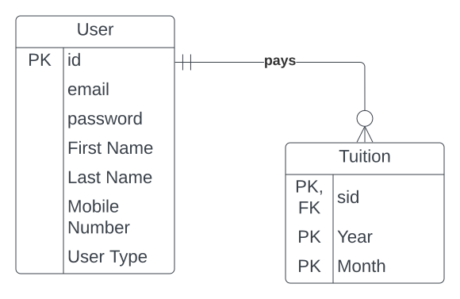

        
    </a>

## Class Management System

This Class Management System is built using Vue JS with Vue Router and Bootstrap
as the front-end SPA with Laravel as the backend RESTful API service provider along 
with Laravel Sanctum for authentication.

The Class Management System utilizes the provided database relation schema.

For recreating the setup
* Before starting make sure composer is installed in the system as well php.
* First in the terminal git clone this project and cd into this project directory.
* Then run `composer install`
* Then run `cp .env.example .env` and add your necessary database credentials in .env file. For instance, first create a database in your favorite database software.
* Then run `php artisan key:generate`
* Then install npm packages by running `npm install`
* In order to start the server run `php artisan serve` and go to link provided by the command.
* The database migrations and seeds are already present, to fill the database with test data run `php artisan migrate:refresh --seed`
* For routes use the commands -
  * `php artisan route:clear` for clearing route cache
  * `php artisan optimize` for regenerating and optimizing routes
  * `php artisan route:list` for seeing all the available routes

So far,
Some basic CRUD operation works.

